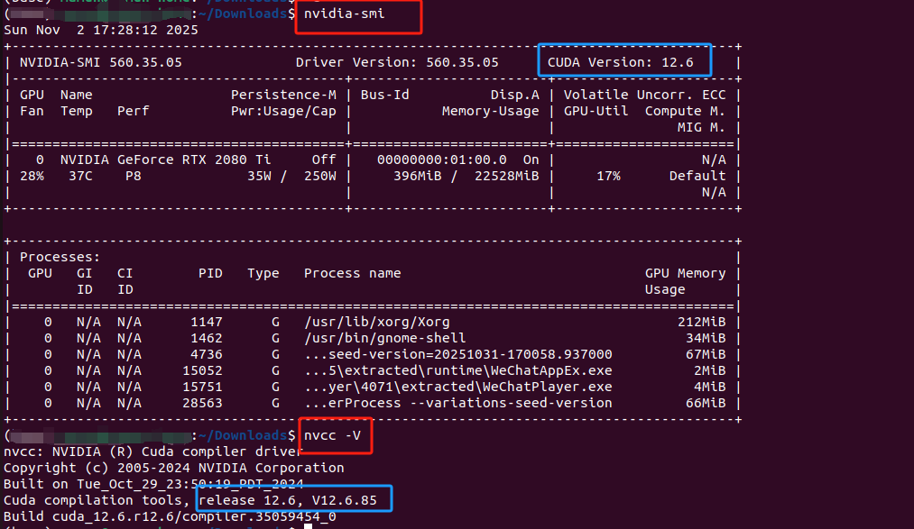

Here's a complete guide to completely remove NVIDIA/CUDA from Ubuntu and perform a fresh installation:

## Step 1: Fully remove NVIDIA/CUDA 

### Stop all NVIDIA processes 
```bash

sudo systemctl stop nvidia-*
sudo systemctl disable nvidia-*
```

### Remove all NVIDIA packages
```bash

sudo apt-get purge '^nvidia-.*' '^libnvidia-.*' '^cuda-.*' '^nsight-.*'
sudo apt-get autoremove
```


### Clean up residual files
```bash

sudo rm -rf /usr/local/cuda*
sudo rm -rf /etc/alternatives/cuda*
sudo rm -rf /usr/lib/cuda*
sudo rm -rf /usr/share/cuda*
sudo rm -rf /opt/nvidia*
sudo rm -rf /var/lib/dkms/nvidia*

```


### Remove configuration files
```bash

sudo rm /etc/modprobe.d/nvidia*
sudo rm /etc/X11/xorg.conf.nvidia*
```

## Step 2: Kernel Module Cleanup


### Rebuild kernel modules
```bash
sudo update-initramfs -u
sudo dkms remove --all
sudo apt-get install --reinstall linux-headers-$(uname -r)

```

## Step 3: Fresh Installation
Option A: Official NVIDIA Driver + CUDA (Recommended)

# Add NVIDIA repository
```bash
sudo add-apt-repository ppa:graphics-drivers/ppa
sudo apt update

```

# Install driver (adjust version as needed)
```bash
sudo ubuntu-drivers autoinstall
```


# Install CUDA via official NVIDIA package
```bash
wget https://developer.download.nvidia.com/compute/cuda/repos/ubuntu2204/x86_64/cuda-ubuntu2204.pin
sudo mv cuda-ubuntu2204.pin /etc/apt/preferences.d/cuda-repository-pin-600
sudo apt-key adv --fetch-keys https://developer.download.nvidia.com/compute/cuda/repos/ubuntu2204/x86_64/3bf863cc.pub
sudo add-apt-repository "deb https://developer.download.nvidia.com/compute/cuda/repos/ubuntu2204/x86_64/ /"
sudo apt update
sudo apt install -y cuda

```

Option B: Using Runfile (More Control)

# Download latest driver and CUDA
```bash
wget https://us.download.nvidia.com/XFree86/Linux-x86_64/latest/NVIDIA-Linux-x86_64.run
wget https://developer.download.nvidia.com/compute/cuda/12.4.1/local_installers/cuda_12.4.1_550.54.15_linux.run

```

# Install driver
```bash
sudo sh NVIDIA-Linux-x86_64.run --silent --dkms
```
# Install CUDA

```bash

sudo sh cuda_12.4.1_550.54.15_linux.run --silent --toolkit --override
```

Step 4: Post-Installation Setup

# Add to PATH
```bash
echo 'export PATH=/usr/local/cuda/bin:$PATH' >> ~/.bashrc
echo 'export LD_LIBRARY_PATH=/usr/local/cuda/lib64:$LD_LIBRARY_PATH' >> ~/.bashrc
source ~/.bashrc

```


# Verify installation
```bash

nvidia-smi
nvcc --version
```

### NOTE: CUDA version in driver and  build in NVCC should be same


### *********************************Other related troubleshooting Tips:
### If you get "Secure Boot" errors during driver installation:

```bash
sudo mokutil --disable-validation

```
### (Then reboot and follow on-screen instructions)
### If X server is running and causing issues:

```bash

sudo systemctl stop gdm
sudo telinit 3

```

### (Run installer in text mode, then sudo systemctl start gdm after)

### For dependency issues:
```bash

sudo apt --fix-broken install
sudo dpkg --configure -a
```


